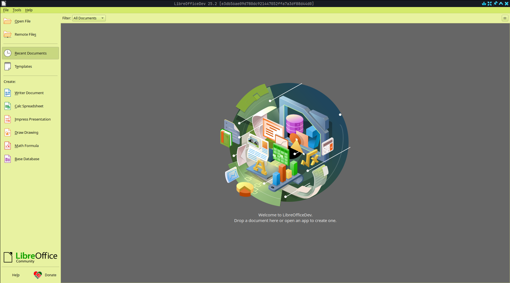
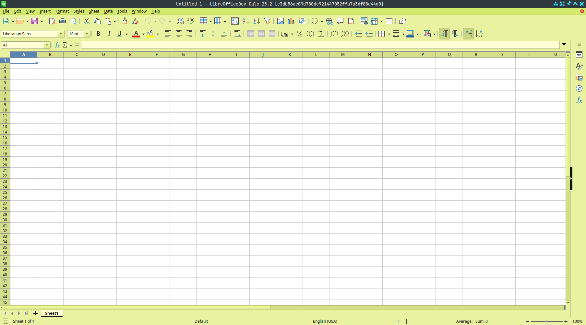
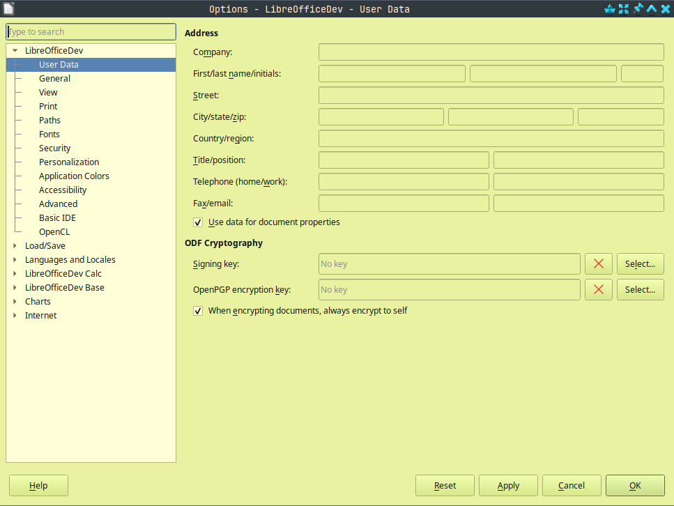

# LibreOffice Theme Template

LibreOffice will soon offer UI color customization capabilities, allowing users to change the application's color using an
extension. Currently, LibreOffice relies on the desktop environment's theme colors, which can often be unsatisfactory; for
example, the contrast in dark mode on Windows may not be suitable for an office application.

You can just download this extension, change the `Theme.xcu` file and run `zip -r <theme-name>.oxt "."` command to create
a theme named `<theme-name>.oxt`.

## Gallery

